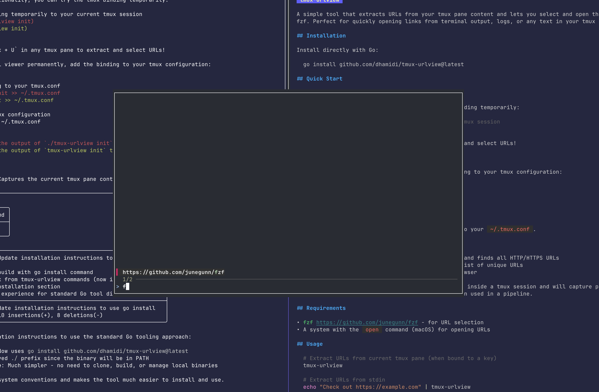

# tmux-urlview

**Zero-config URL extraction for tmux.** See a link in your terminal? Press a key, pick it, open it. No configuration files, no complex setup, no ongoing maintenance. This is "done" software—install once, use forever, never think about it again.



## Installation

Install directly with Go:
```bash
go install github.com/dhamidi/tmux-urlview@latest
```

## Quick Start

### Try it out

To test the functionality, you can try the tmux binding temporarily:
```bash
# Apply the binding temporarily to your current tmux session
tmux $(tmux-urlview init)
```

Now press `Prefix + U` in any tmux pane to extract and select URLs!

### Make it permanent

To enable the URL viewer permanently, add the binding to your tmux configuration:

```bash
# Add the binding to your tmux.conf
tmux-urlview init >> ~/.tmux.conf

# Reload your tmux configuration
tmux source-file ~/.tmux.conf
```

Or manually add the output of `tmux-urlview init` to your `~/.tmux.conf`.

## How it works

1. **Extract**: Captures the current tmux pane content and finds all HTTP/HTTPS URLs
2. **Select**: Uses fzf to present a fuzzy-searchable list of unique URLs
3. **Open**: Opens the selected URL in your default browser

The tool automatically detects whether it's running inside a tmux session and will capture pane content accordingly, or fall back to reading from stdin when used in a pipeline.

## Requirements

- [fzf](https://github.com/junegunn/fzf) - for URL selection
- A system with the `open` command (macOS) for opening URLs

## Usage

```bash
# Extract URLs from current tmux pane (when bound to a key)
tmux-urlview

# Extract URLs from stdin
echo "Check out https://example.com" | tmux-urlview

# Get tmux binding configuration
tmux-urlview init
```

## Built with Amp

This entire project was "vibe coded" with [Amp](https://ampcode.com)—from initial concept to tests to documentation. Without AI pair programming, this would have been yet another "great idea" that never shipped. Sometimes the difference between software existing and not existing is having the right tools to go from idea to done in one session.

## License

MIT License - see [LICENSE](LICENSE) for details.
